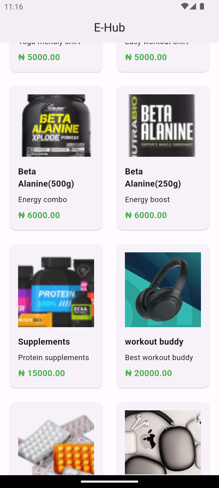

# shopping_app ReadMe

This is a single page mobile app which calls a Timbu Api to get listed products and populates the "All Products" screen with the details of these products including product image

## Table of Contents
-[Features](#features)
-[Installation](#installation)
-[Usage](#usage)
-[ProjectStructure](#project structure)
-[Contributing](#configuration)
-[License](#license)

## Features
Fetch and display products from a remote API
Error handling for network requests
Responsive grid layout for product display
Lazy loading of images with placeholder
Clean and organized project structure
Product Listing: List product details, including price, description, and image.

## Installation
Follow these steps to install and run shopping app on your system.
Clone the repository:

bash
git clone https://github.com/shallom-dot/hng-stage-2
cd E_hub
Install dependencies:

bash
Copy code
flutter pub get

Set up environment variables:
Create a .env file in the root of your project and add your API configuration:
API_URL=https://api.example.com
API_KEY=your_api_key
ORGANIZATION_ID=your_organization_id
APP_ID=your_app_id
API_IMAGE_URL=https://images.example.com/

Run the app:
bash
Copy code
flutter run

## Usage
All Products: Displays list of products
## Project Structure
e_hub/
├── lib/
│   ├── main.dart
│   ├── models/
│   │   └── product_model.dart
│   ├── └── api_model.dart
│   ├── services/
│   │   └── product_services.dart
│   ├── screens/
│   │   └── productlistingscreen.dart
├── pubspec.yaml
├── .env

lib/main.dart:
Entry point of the application.

lib/models/:
Contains data models used in the application.

lib/services/:
Contains services that interact with APIs or other data sources.

lib/screens/:
Contains different screens of the application.

.env:
Environment variables used in the application.

## Screenshots

## download link
[Download the apk here](https://drive.google.com/drive/folders/1G2vuERoQweOOFg0gO0dbZAW7R3VYnCGq?usp=sharing)

## Contributing
Contributions are welcome! Please follow these steps to contribute:

Fork the repository.
Create a new branch (git checkout -b feature-branch).
Make your changes.
Commit your changes (git commit -m 'Add some feature').
Push to the branch (git push origin feature-branch).
Open a pull request.
## License
This project is licensed under the MIT License. See the LICENSE file for details.

